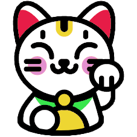

<h1 align="center">
  Назва: KotikiShop
</h1>

  

<h1 align="center">
  Мета
</h1> 
Розробити сайт з великим функціоналом, красивим дизайном та зручним інтерфейсом.
<h1 align="center">
  Користувачі та їх можливості
</h1>
<h2>
  Guest - гість
</h2>
Має можливість дивитись каталог, для додаткових можливостей повинен зареєструватися.
<h2>
  Customer - покупець
</h2>
Має можливості дивитись каталог, кошик своїх покупок, додавати котів в кошик та робити замовлення. Також має можливість дивитися та редагувати дані свого облікового запису.
<h2>
  Admin - адмін
</h2>
Має всі можливості покупця, також може редагувати пропозиції по продажу котів, та редагувати каталог.
<h1>
  Основні сутності (основні об'єкти, якими оперує застосунок, та їх поля)
</h1>
Cat, CatFamily, Application User
<h1>
  Можливості застосунку
</h1>
Якщо хочете знайти собі лагідного та ніжного породистого котика то вам до нас! Наш сайт пропонує наступні можливості: 
Каталог котиків та їх фільтр по ціні, породі та віку 
Пошук по вашому запиту 
Зручний кошик покупок 
<h1>
  Вибір технології UI
</h1>
ASP.NET MVC
<h3>
  Ключові переваги:
</h3>
Розподіл обов’язків – архітектура MVC (Model-View-Controller) дозволяє чітко розділити логіку додатка, що спрощує підтримку та тестування. 
Гнучкість у розробці – можна легко налаштовувати компоненти, використовувати різні бібліотеки JavaScript (наприклад, jQuery, React, Vue). 
Вбудована підтримка Razor – ефективний механізм створення динамічних HTML-сторінок. 
Висока продуктивність – завдяки кешуванню та оптимізованому рендерингу сторінок. 
Легка інтеграція з .NET – дозволяє використовувати потужні можливості .NET (наприклад, Entity Framework, LINQ). 
SEO-дружність – підтримка чистих URL, що важливо для пошукової оптимізації. 
Безпека – вбудований захист від CSRF, XSS, SQL-ін’єкцій.
